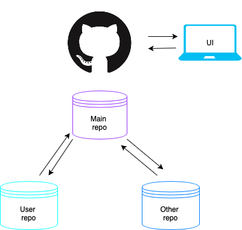
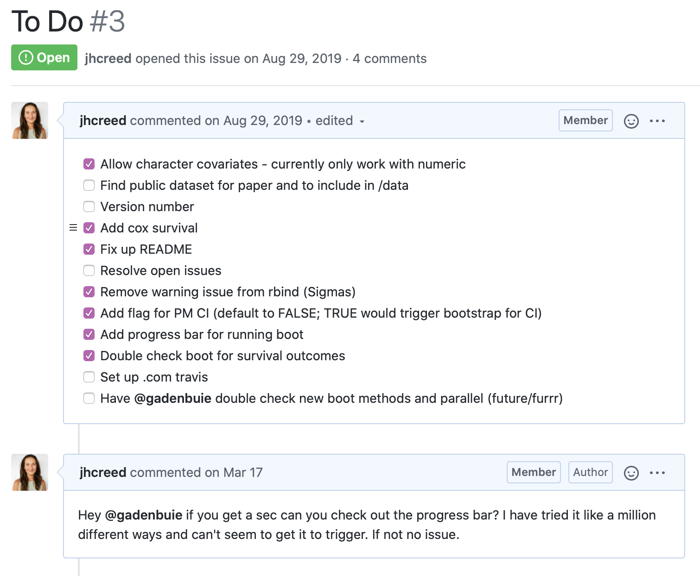
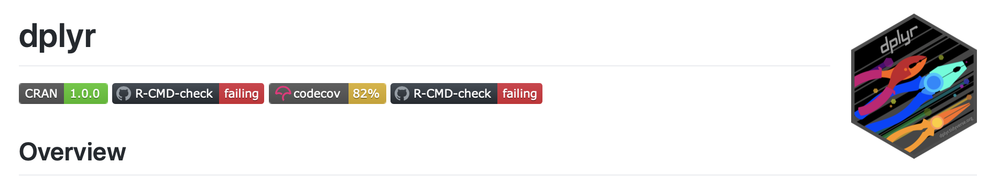
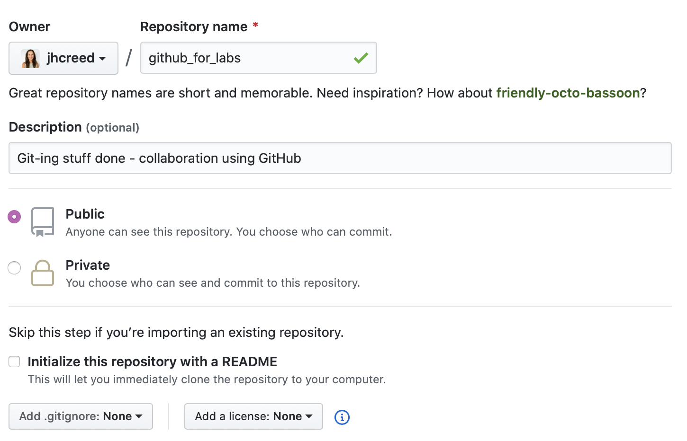
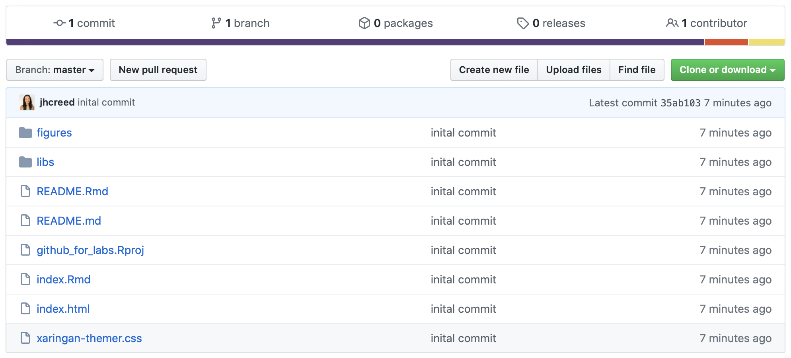
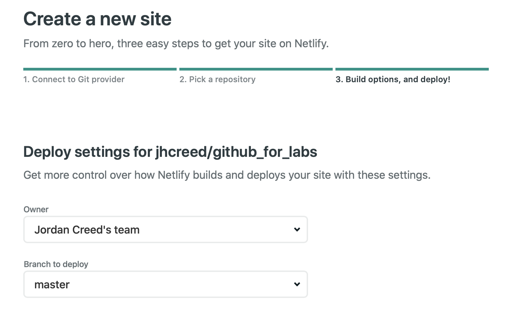
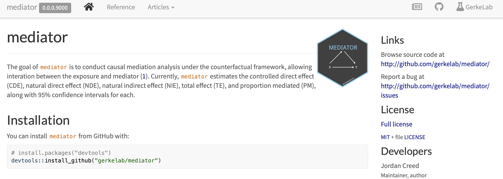

```{r xaringan-themer, include = FALSE}
library(xaringanthemer)
duo_accent(primary_color = "#60E83A", secondary_color = "#F9850A")
```

```{r setup, include=FALSE}
knitr::opts_chunk$set(
  fig.width = 10, fig.height = 6, fig.retina = 2,
  warning = FALSE, message = FALSE
)

xaringanExtra::use_xaringan_extra(c("animate_css", "text_poster", "panelset"))
xaringanExtra::use_tachyons()
```

class: center middle hide-count hide-logo

<div class="talk-logo"></div>

.talk-meta[
  .talk-title[# Git-ing stuff done <br> .smaller[GitHub for labs]]

  .talk-author[Jordan Creed]
  
  .talk-date[ @jhcreed]
]

???

---

## Terminology 

.accent-orange[Git] is software for code versioning within remote repositories

.accent-orange[Repository] (often called repo) is a collection of files 

.accent-orange[GitHub] is a cloud based service/UI for hosting git repositories and includes additional services/features, such as issue tracking and hosting web pages

.accent-orange[GitLab] is a hosting service similar to GitHub but allows for hosting private projects

.accent-orange[Branches] are independent lines of development

.accent-orange[Commit] is a change saved to the repo - checkpoint of all the chnages up to this point 

.accent-orange[Staged] changes are changes that will be included in the next commit, while .accent-orange[unstaged] changes will not be included in the next commit. 

`r emo::ji("warning")` Both .accent-orange[GitHub] and .accent-orange[GitLab] use .accent-orange[git] for code versioning within their service. Additional differences exist between the two concerning terminology, popularity, continuous integration and 3rd party software. 

---

## GitHub as a project manager

.pull-left[
+ Contain all files and their histories
+ Access most up-to-date versions
+ Change/modify files without risk of harming anything
+ Set restriction to who can access/edit projects 
+ Track progress
+ Single location for all communication/files/deliverables 
]

.pull-right[

]

---

## GitHub Issues 

.pull-left[
- Integrated with web interface
- Sent through email as well as kept online 
    + tracked in your normal communication channels
    + copy/embed emails in the associated repo
- Can be assigned to people (e.g. `@jhcreed`) and tagged ("bug `r emo::ji("bug")`")
- Linked with commits 
    + allow you to record when a specific change fixed a specific bug/issue

Ways we can use issues in our workflow:
+ track bugs and request features
+ collaborate on complex figures 
+ discuss various aspects of analyses 
]

.pull-right[

]

---

# Basic set-up

.pull-left[
1. Register for a [GitHub](https://github.com) account (Free!)
2. .accent-orange[Install/update R and RStudio]
3. Install Git (OS-dependent)
4. Get Git and GitHub talking
5. .accent-orange[Cache username and password/setup SSH keys]
6. .accent-orange[Get Git and RStudio talking]
7. .accent-orange[Install Git client]
    + RStudio
    + GitKraken
    + SourceTree
    + GitHub Desktop
    + GitUp
]

.pull-right[

]
    
`r emo::ji("shrug")` There are no style points in Git so simply use whatever system works best for you 

`r emo::ji("bomb")` Sometimes the easiest option is to just nuke your local copy and clone a fresh version - there is no shame in it, we have ALL been there

---
background-image: url(figures/github_workflow.png)
background-size: 50%
background-position: 50% 85%

## Workflow

Each project should have: 

- A dedicated directory/folder
- Rstudio Project - _if R based_
- Git repository

Continue with your project as usual (writing code or reports) but in _addition_ to saving each file, you should also commit your work and periodically push your commits to GitHub. 

- a commit is taking a snapshot of your work at that time 
    - everytime you add a feature, fix a bug, or write any line of code that does an action 
    - every time you would save a file you should commit a file
- pushing your work makes it accessible to others 
    - do not _need_ to push as often as you commit 
    - should do when you finish a session working on a project
    
---

# README

The top-level README can be thought of as a free website for each project. Each subdirectory can have one as need be. REAME's should follow a similar template across all projects. 

Elements to include: 
- .accent-orange[Header:] Package/project name, hex sticker/graphic, badges
- .accent-orange[Getting Started:] Prerequisites, installation instructions (working and dev version) with examples
- .accent-orange[Cheatsheet] if applicable
- .accent-orange[Usage:] Examples of core functionality
- .accent-orange[Comaprison to other tools] if available
- .accent-orange[Additional resources/Getting help] 
- .accent-orange[Code of Conduct] with link to contributor code of conduct if allowing outside contributors

.h-center[

]

---

.pull-left[
.blank[blank line]


]
.pull-right[
.blank[blank line]

.blank[blank line]

## GitHub in practice

1. Master branch should always be deployable
2. Define code owners
3. Don't commit secrets 
4. Update the .gitignore
5. Write meaningful commit messages
6. Commit early and often
7. Dont jump to one large commit 
8. Avoid monster pulls 
9. Utilize 3rd party add-ins
10. Keep in consistent/organized

] 

---

class: center middle

.dramatic[
Lets 
Build A
Repo!
]

---

## Create a new repo

.w-75.h-center[

]

---

## Filling up the repo

.h-center[
```
$ cd /Documents/github/talks_folder/github_for_labs
$ git init
$ git remote add origin https://github.com/jhcreed/github_for_labs.git
$ git add *
$ git commit -m "inital commit" 
$ git push -u origin master
```
]

.w-70.h-center[

]

---

## Diff

---

## GitHub Actions 

---

## Netlify

Netlify is a static website generator. It allows users to create webpages through GitHub and is used for publishing slides and help pages. To use netlify:
+ Create a Netlify account 
+ Push your code to GitHub 
+ Connect your GitHub repo to your Netlify account 
+ .accent-orange[Set up continuous integration]
+ .accent-orange[Add a custom domain]

.w-50.h-center[

]

---

## pkgdown

pkgdown is a tool for creating a website for your package/project based on the GitHub repo. 
+ README -> Homepage
+ vignettes -> Articles
+ man -> Reference

```{r eval=FALSE}
install.packages("pkgdown")

# Run once to configure pkgdown for your repo
usethis::use_pkgdown()

# To build site
pkgdown::build_site()
```

.w-50.h-center[

]

---

## Additional Resources 

Git/GitHub basics 
+ [Excuse me, do you have a moment to talk about version control?](https://peerj.com/preprints/3159/)
+ [Happy Git and GitHub for the useR](https://happygitwithr.com)

Git commands 
+ [Basic Git commands](https://github.com/joshnh/Git-Commands)
+ [Git Command Explorer](https://gitexplorer.com)
+ [10 Git commands in Rstudio](https://rviews.rstudio.com/2020/04/23/10-commands-to-get-started-with-git/)

GitHub Actions 
+ [Actions Sandbox](https://ropenscilabs.github.io/actions_sandbox/)


```{css, echo=FALSE}
.talk-logo {
  width: 480px;
  height: 556px;
  position: absolute;
  top: 10%;
  left: 50%;
  background-image: url('figures/octocat.png');
  background-size: cover;
  background-repeat: no-repeat;
}
.talk-meta {
  #font-family: Overpass;
  position: absolute;
  text-align: left;
  bottom: 10px;
  left: 25px;
}
.talk-author {
  color: #444;
  font-weight: bold;
  font-size: 1.5em;
  line-height: 1em;
}
.talk-date {
  color: #666;
  font-size: 1.25em;
  line-height: 0;
}
.hide-count .remark-slide-number {
  display: none;
}

# sizing 
.w-50 {
  width: 50%;
}
.w-25 {
  width: 25%;
}
.w-40 {
  width: 40%;
}
.w-75 {
  width: 75%;
}
.w-70 {
  width: 70%;
}
.w-115 {
  width: 115%;
}
.w-150 {
  width: 150%;
}
.h-center {
  margin: 0 auto;
}
.top-0    { top:    0; }
.right-0  { right:  0; }
.bottom-0 { bottom: 0; }
.left-0   { left:   0; }

# colors

.accent-other { 
  color: light brilliant orange,
}
.accent-purple { 
  color: #b668f7; 
}
.accent-blue { 
  color: #00bfff ;
}
.accent-orange{
  color: #f9850a ;
}

.blank { 
  color: white ;
}


.dramatic p {
  font-size: 145px;
  color: #f9850a ;
  margin-top: 0;
  margin-bottom: 0;
}


```


